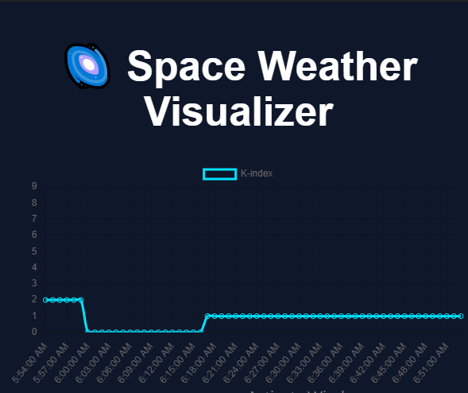

# 🌌 Space Weather Visualizer

This is a real-time space weather visualizer that shows planetary **K-index** data (a measure of geomagnetic activity) fetched from NOAA’s public API.

## 📊 What It Shows

- Real-time space weather (K-index) over the last hour
- Clean line chart visualization using Chart.js
- Fully responsive and runs entirely in the browser

## ⚙️ Built With

- React (StackBlitz template)
- Chart.js (via CDN)
- NOAA SWPC API: [`planetary_k_index_1m.json`](https://services.swpc.noaa.gov/json/planetary_k_index_1m.json)

## 🚀 Live Preview

Deployed Link: https://space-weather-visualizer.vercel.app/

## 💡 How It Works

- Fetches the latest space weather K-index values every minute
- Displays them in a clean line chart
- Ideal for monitoring geomagnetic storm activity

---

## 📸 Preview

---

## 👩‍💻 Author

Submitted by Anushri Adapawar for Agnirva Internship Program 2025.
